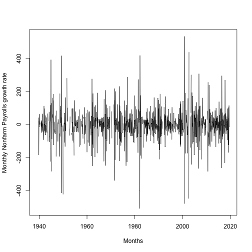
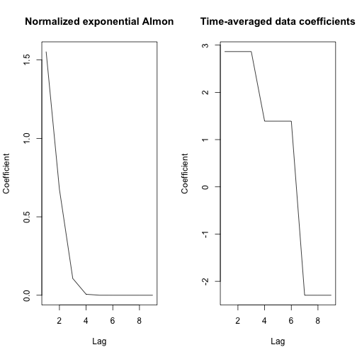
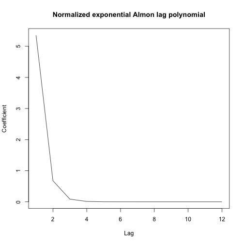
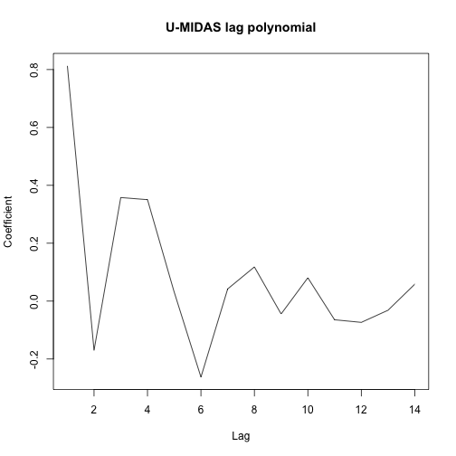

Macro forecasting: ARDL-MIDAS regressions
========================================================


ARDL-MIDAS regression
========================================================

ARDL-MIDAS($p_y^Q,q_X^M$) model

$$
\begin{equation}
    Y_{t+h}^{Q,h} = \mu_h + \sum_{j=0}^{p_y^Q-1}\rho_{j+1}^h Y_{t-j}^Q + \beta^h \sum_{j=0}^{q_X^M-1} \sum_{i=0}^{m-1} \omega_{i+j*m}(\theta_h) X_{m-i,t-j}^M + \epsilon_{t+h}^h
\end{equation}
$$

where

* $Y_{t+h}^{Q,h}$ --- low-frequency (quarterly) target variable
* $X_{m-i,t-j}^M$ --- high-frequency (monthly) predictor variable
* $\omega_{i+j*m}(\theta_h)$ --- weight function
* $\Theta := (\mu_h,\rho_{1},\dots,\rho_{p_y^Q},\beta^h,\theta_h)$ --- model parameters estimated by NLS


Macro forecasting
========================================================
Preliminaries 


```r
# Clean workspace
rm(list=ls())
# Load required package
require("MIDASLec")
# Load data for macro examples:
data("example1")
```


Check if data is loaded in your RStudio (Environment)

You should see: ads, cfnai, payems, rgdp


Trasform data to growth rates
========================================================

ADS and CFNAI are macro factors, we don't need to transform them

## payems: 


```r
payems[-1, 2] <- log(payems[-1, 2]/payems[-dim(payems)[1], 2])*100
payems <- payems[-1, ]
```

you can plot it to check if it looks as expected

Trasform data to growth rates
========================================================

```r
plot(payems[,1], payems[,2], type='l', ylab='Monthly Nonfarm Payrolls growth rate', xlab='Months')
```



Trasform data to growth rates
========================================================

## rgdp:


```r
rgdp[-1, 2] <- log(rgdp[-1, 2]/rgdp[-dim(rgdp)[1], 2])*100
rgdp <- rgdp[-1, ]
```


MIDAS in R
========================================================

There are several packages in R to run different MIDAS regressions. 

For this example we will rely on midasr package with some additional functions in MIDASLec.

Nonfarm Payrolls, construct MIDAS data structures which will be used in MIDAS models.

## First example is with Nonfarm Payrolls data

Set intial and last date for in-sample estimation:


```r
est.start <- "1985-01-01"
est.end <- "2009-01-01"
```

Nonfarm Payrolls example
========================================================

Get data structures needed for MIDAS regression:


```r
data.payems.in <- mixed.freq.data(rgdp[,2], rgdp[,1], payems[,2], payems[,1], x.lag=9, y.lag=1, horizon=3, est.start=as.Date(est.start), est.end=as.Date(est.end), disp.flag = TRUE)
```

```
Frequency of Data Y: 3 month(s) 
Frequency of Data X: 1 month(s) 
Start Date:  1985-01-01 
Terminal Date:  2009-01-01 
Mixed frequency regression time frame: 

Reg Y(1985-03-01)`s on: Y(1984-12-01)`s X(1984-12-01)`s X(1984-11-01)`s ... X(1984-04-01)`s
Reg Y(1985-06-01)`s on: Y(1985-03-01)`s X(1985-03-01)`s X(1985-02-01)`s ... X(1984-07-01)`s
Reg Y(2009-03-01)`s on: Y(2008-12-01)`s X(2008-12-01)`s X(2008-11-01)`s ... X(2008-04-01)`s
```

Nonfarm Payrolls example
========================================================

For this example we use exponential Almon weights


```r
weight <- nealmon
```

Get a set of good starting values for nonlinear optimzation


```r
set.seed(123)
startx.all <- get.start.adl.midas(y=data.payems.in$est.y, X=data.payems.in$est.x, z=data.payems.in$est.lag.y, weight=weight, par.num.weight=3, num.evals=10000, num.coef=1)
```

Nonfarm Payrolls example
========================================================

Estimate ARDL-MIDAS regression using *midas_r_plain* function from midasr package


```r
payems.est.midas <- midas_r_plain(y=data.payems.in$est.y, X=data.payems.in$est.x, z=cbind(data.payems.in$est.lag.y, rep(1,times=length(data.payems.in$est.y))), weight=weight, startx=startx.all[-c(4,5)], startz=startx.all[c(4,5)] ,control=list(maxit=500))
```

Nonfarm Payrolls example
========================================================

Estimate ARDL regression model using time-averaged Nonfarm Payrolls data


```r
payems.est.ta <- lm(data.payems.in$est.y ~ data.payems.in$est.lag.y + rowMeans(data.payems.in$est.x[,1:3]) + rowMeans(data.payems.in$est.x[,4:6]) + rowMeans(data.payems.in$est.x[,7:9]))
```


Nonfarm Payrolls example
========================================================

Compare in-sample performance


```r
sqrt(mean(payems.est.midas$residuals^2))
```

```
[1] 0.5103188
```

```r
sqrt(mean(payems.est.ta$residuals^2))
```

```
[1] 0.4945295
```

Nonfarm Payrolls example
========================================================

Compare out-of-sample performance


```r
payems.midas.oos <- forecast.adl(payems.est.midas, weight=weight, par.num.weight=3, data.payems.in, is.intercept=TRUE)
payems.ta.oos <- forecast.ta.example(payems.est.ta, data.payems.in)
```


```r
payems.midas.oos$rmse
```

```
[1] 0.4461215
```

```r
payems.ta.oos$rmse
```

```
[1] 0.4486757
```


Nonfarm Payrolls example
========================================================

Plot lag polynomials


```r
par(mfrow=c(1,2)) 

plot( weight(payems.est.midas$coefficients[c(1,2,3)], d = 9), type = 'l', xlab='Lag', ylab='Coefficient', main='Normalized exponential Almon')

plot( c(rep(as.numeric(payems.est.ta$coefficients[3]), times = 3), rep(as.numeric(payems.est.ta$coefficients[4]), times = 3), rep(as.numeric(payems.est.ta$coefficients[5]), times = 3)), type = 'l', xlab='Lag',ylab='Coefficient', main='Time-averaged data coefficients')
```


Nonfarm Payrolls example
========================================================




Nonfarm Payrolls example
========================================================

We will compare fixed, rolling, expanding windows predictions of GDP using these two models.

## Fixed window

### MIDAS


```r
payems.midas.obj.fixed <- midas.adl(data.y = rgdp[,2], data.ydate = rgdp[,1], data.x = payems[,2], data.xdate = payems[,1], est.start = as.Date(est.start), est.end = as.Date(est.end), horizon = 3, x.lag = 9, y.lag = 1, polynomial = "nealmon", method = "fixed",disp.flag = FALSE, num.evals = 10000, num.coef = 1)
```


Nonfarm Payrolls example
========================================================

## Fixed window

### Time-averaged data


```r
payems.ta.obj.fixed <- midas.adl(data.y = rgdp[,2], data.ydate = rgdp[,1], data.x = payems[,2], data.xdate = payems[,1], est.start = as.Date(est.start), est.end = as.Date(est.end), horizon = 3, x.lag = 9, y.lag = 1, polynomial = "timeaverage", method = "fixed",disp.flag = FALSE)
```

We compared predictions already for fixed scheme


Nonfarm Payrolls example
========================================================

## Rolling window

### MIDAS


```r
payems.midas.obj.rolling <- midas.adl(data.y = rgdp[,2], data.ydate = rgdp[,1], data.x = payems[,2], data.xdate = payems[,1], est.start = as.Date(est.start), est.end = as.Date(est.end), horizon = 3, x.lag = 9, y.lag = 1, polynomial = "nealmon", method = "rolling",disp.flag = FALSE, num.evals = 10000, num.coef = 1)
```

### Time-averaged data


```r
payems.ta.obj.rolling <- midas.adl(data.y = rgdp[,2], data.ydate = rgdp[,1], data.x = payems[,2], data.xdate = payems[,1], est.start = as.Date(est.start), est.end = as.Date(est.end), horizon = 3, x.lag = 9, y.lag = 1, polynomial = "timeaverage", method = "rolling",disp.flag = FALSE)
```


Nonfarm Payrolls example
========================================================

Compare predictions for rolling window

```r
payems.midas.obj.rolling$pred.obj$rmse
```

```
[1] 0.4284624
```

```r
payems.ta.obj.rolling$pred.obj$rmse
```

```
[1] 0.4325905
```


Nonfarm Payrolls example
========================================================


## Expanding window

### MIDAS


```r
payems.midas.obj.expand <- midas.adl(data.y = rgdp[,2], data.ydate = rgdp[,1], data.x = payems[,2], data.xdate = payems[,1], est.start = as.Date(est.start), est.end = as.Date(est.end), horizon = 3, x.lag = 9, y.lag = 1, polynomial = "nealmon", method = "expand",disp.flag = FALSE, num.evals = 10000, num.coef = 1)
```

### Time-averaged data


```r
payems.ta.obj.expand <- midas.adl(data.y = rgdp[,2], data.ydate = rgdp[,1], data.x = payems[,2], data.xdate = payems[,1], est.start = as.Date(est.start), est.end = as.Date(est.end), horizon = 3, x.lag = 9, y.lag = 1, polynomial = "timeaverage", method = "expand",disp.flag = FALSE)
```


Nonfarm Payrolls example
========================================================

Compare predictions for expanding window

```r
payems.midas.obj.expand$pred.obj$rmse
```

```
[1] 0.4295506
```

```r
payems.ta.obj.expand$pred.obj$rmse
```

```
[1] 0.4369391
```


CFNAI example
========================================================

Set weighting function, sort data and get good initial values


```r
weight <- nealmon
est.start <- "1987-01-01" 
est.end <- "2011-12-01"

data.cfani.in <- mixed.freq.data(rgdp[,2], rgdp[,1], cfnai[,2], cfnai[,1], x.lag=12, y.lag=1, horizon=3, est.start=as.Date(est.start), est.end=as.Date(est.end), disp.flag = FALSE)


set.seed(123)
startx.all <- get.start.adl.midas(y=data.cfani.in$est.y, X=data.cfani.in$est.x, z=data.cfani.in$est.lag.y, weight=weight, par.num.weight=3, num.evals=10000, num.coef=1)
```

CFNAI example
========================================================

Estimate MIDAS and U-MIDAS regressions


```r
cfnai.est.midas <- midas_r_plain(y = data.cfani.in$est.y, X = data.cfani.in$est.x, z = cbind(data.cfani.in$est.lag.y, rep(1,times = length(data.cfani.in$est.y))), weight=weight,startx = startx.all[-c(4,5)], startz = startx.all[c(4,5)], control = list(maxit = 1000))

cfnai.est.umidas <- lm(data.cfani.in$est.y ~ data.cfani.in$est.lag.y + data.cfani.in$est.x)
```

CFNAI example
========================================================

Compare in-sample performance


```r
sqrt(mean(cfnai.est.midas$residuals^2))
```

```
[1] 0.4848867
```

```r
sqrt(mean(cfnai.est.umidas$residuals^2))
```

```
[1] 0.4551793
```

CFNAI example
========================================================

Compare out-of-sample performance


```r
cfnai.midas.oos <- forecast.adl(cfnai.est.midas, weight=weight, par.num.weight=3, data.cfani.in, is.intercept=TRUE)
cfnai.umidas.oos <- forecast.umidas(cfnai.est.umidas, data.cfani.in)
```


```r
cfnai.midas.oos$rmse
```

```
[1] 0.3154912
```

```r
cfnai.umidas.oos$rmse
```

```
[1] 0.3367636
```


CFNAI example
========================================================

Plot lag polynomials: exponential Almon


```r
plot(weight(cfnai.est.midas$coefficients[c(2,3)], d = 12), type = 'l', xlab = 'Lag', ylab = 'Coefficient', main = 'Normalized exponential Almon lag polynomial')
```



CFNAI example
========================================================

Plot lag polynomials: unrestricted


```r
plot(coef(cfnai.est.umidas), type = 'l', xlab = 'Lag', ylab = 'Coefficient', main = 'U-MIDAS lag polynomial')
```




ADS example
========================================================

Set sample dates


```r
est.start <- "1987-01-01" 
est.end <- "2011-12-01"
```

ADS example
========================================================

Compute MIDAS forecasts


```r
ads.midas.obj.fixed.for <- midas.adl(data.y = rgdp[,2], data.ydate = rgdp[,1], data.x = ads[,2], data.xdate = ads[,1], est.start = as.Date(est.start), est.end = as.Date(est.end), horizon = 66, x.lag = 66, y.lag = 1, polynomial = "nealmon", method = "fixed", disp.flag = TRUE, num.evals = 10000, num.coef = 10)
```

ADS example
========================================================

Compute U-MIDAS forecasts


```r
ads.umidas.obj.fixed.for <- midas.obj.fixed.for <- midas.adl(data.y = rgdp[,2], data.ydate = rgdp[,1], data.x = ads[,2], data.xdate = ads[,1], est.start = as.Date(est.start), est.end = as.Date(est.end), horizon = 66, x.lag = 66, y.lag = 1, polynomial = "umidas", method = "fixed", disp.flag = TRUE)
```


ADS example
========================================================

Compute MIDAS nowcasts


```r
ads.midas.obj.fixed.now <- midas.adl(data.y = rgdp[,2], data.ydate = rgdp[,1], data.x = ads[,2], data.xdate = ads[,1], est.start = as.Date(est.start), est.end = as.Date(est.end), horizon = 22, x.lag = 66, y.lag = 1, polynomial = "nealmon", method = "fixed", disp.flag = TRUE, num.evals = 10000, num.coef = 10)
```

ADS example
========================================================

Compute U-MIDAS nowcasts


```r
ads.umidas.obj.fixed.now <- midas.obj.fixed.for <- midas.adl(data.y = rgdp[,2], data.ydate = rgdp[,1], data.x = ads[,2], data.xdate = ads[,1], est.start = as.Date(est.start), est.end = as.Date(est.end), horizon = 22, x.lag = 66, y.lag = 1, polynomial = "umidas", method = "fixed", disp.flag = TRUE)
```


ADS example
========================================================

Compare forecasts


```r
ads.midas.obj.fixed.for$pred.obj$rmse
```

```
[1] 0.3096144
```

```r
ads.umidas.obj.fixed.for$pred.obj$rmse
```

```
[1] 0.6149786
```


ADS example
========================================================

Compare nowcasts


```r
ads.midas.obj.fixed.now$pred.obj$rmse
```

```
[1] 0.3486505
```

```r
ads.umidas.obj.fixed.now$pred.obj$rmse
```

```
[1] 0.7206917
```

Take away
========================================================

MIDAS regression compares well with alternative methods, i.e. time-averaged data or U-MIDAS specifications. 

Even when sampling frequency ratio is small, e.g. quarterly/monthly, more often than not MIDAS regression with tighly paramterized polynomial yields better quality forecasts, mainly through the bias-variance trade-off argument.

NLS estimation is cumbersome, sometimes gives local optimum parameter estimates due to nonlinearities of the objective function. In the case of ARDL-MIDAS, these can be overcome by using profiling approach, see Ghysels and Qian (2019).
